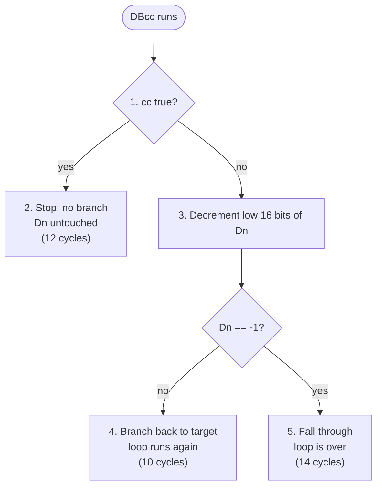

# Opcode & TRAP Reference

This page is filled in progressively, as each part of the emulator becomes real — it documents what you can actually *do* today, not the final wish list (see [Presentation](./PRESENTATION.md) for the full roadmap).

## Registers

The CPU core (registers, status flags, and the fetch-decode-execute loop) is implemented and working.

| Register | Size | Purpose |
|---|---|---|
| `D0`–`D7` | 32-bit | Data registers — general-purpose, for values and arithmetic |
| `A0`–`A7` | 32-bit | Address registers — hold memory addresses. `A7` doubles as the Stack Pointer (SP) |
| `PC` | 32-bit | Program Counter — address of the next instruction to fetch |

On reset, every register is `0` except `A7`, which starts at `$03FFF` (the top of the default stack, which grows downward).

### Status Flags

| Flag | Name | Meaning |
|---|---|---|
| `N` | Negative | Set when the result's sign bit is `1` |
| `Z` | Zero | Set when the result is `0` |
| `V` | Overflow | Set on signed overflow |
| `C` | Carry | Set on unsigned carry/borrow |
| `X` | Extend | Mirrors `C` for most operations; used in multi-precision arithmetic |

Which flags a given instruction touches is listed per-instruction below, in the "Flags affected" column, using three notations: a flag on its own (e.g. `N, Z`) is set or cleared to reflect what the instruction actually produced; a flag followed by `(0)` (e.g. `V (0)`) is unconditionally cleared to `0`, regardless of the result — real hardware does this where the flag has no meaningful value for that instruction (multiply/divide can't overflow the way add/sub can, so `MULU`/`MULS` always clear `V`); and a flag missing from the list entirely is left untouched, keeping whatever value it had before the instruction ran.

## Addressing Modes

An addressing mode is how an instruction says where an operand lives — a register, a memory address, or a constant baked right into the instruction. These are the modes wired in today:

| Mode | Syntax | Example | Description |
|---|---|---|---|
| Data register | `Dn` | `MOVE.L D0,D1` | The value in a data register |
| Address register | `An` | `MOVE.L A0,A1` | The value in an address register |
| Register indirect | `(An)` | `MOVE.L (A0),D0` | The value in memory at the address held in `An` |
| Post-increment | `(An)+` | `MOVE.L (A0)+,D0` | Like indirect, then `An` is bumped by the operand's size |
| Pre-decrement | `-(An)` | `MOVE.L D0,-(A0)` | `An` is decremented by the operand's size first, then used as the address |
| Displacement | `d16(An)` | `MOVE.L $10(A0),D0` | `An` plus a 16-bit displacement |
| Immediate | `#value` | `MOVE.L #100,D0` | A constant baked into the instruction (source only — can't be a destination) |
| Absolute short | `xxx.W` | `MOVE.L $100.W,D0` | A 16-bit address, sign-extended — reaches `$0000`-`$7FFF` (or, on real hardware, the top of memory too; this emulator's address space doesn't extend that far) |
| Absolute long | `xxx.L` | `MOVE.L $40000.L,D0` | A full 32-bit address, written directly into the instruction |
| Indexed | `d8(An,Xn)` | `MOVE.L $10(A0,D1.W),D0` | `An` plus an index register (`Dn` or `An`, `.W` sign-extended or `.L`) plus an 8-bit displacement |
| PC displacement | `d16(PC)` | `MOVE.L $10(PC),D0` | The program counter (at the displacement's own extension word) plus a 16-bit displacement — source only, can't be a destination |
| PC indexed | `d8(PC,Xn)` | `MOVE.L $10(PC,D1.W),D0` | Like Indexed, but based on the program counter instead of an address register — source only |

Absolute addressing works either as shown above or, for an address you'll reuse, by loading it into an address register first with `MOVEA` (e.g. `MOVEA.L #$40000,A0` then `(A0)`) — most examples on this page still use the `MOVEA` style since it's what the addressing modes actually looked like before absolute addressing landed, but either works today.

## Memory Map

The emulator's memory system is implemented and working. Every address below is real, addressable memory:

| Region | Address range | Size | Purpose |
|---|---|---|---|
| System area | `$00000`–`$01FFF` | 8 KB | Reserved for TRAP vectors and system data |
| User RAM | `$02000`–`$3FFFF` | ~248 KB | Your program's code, data, and stack |
| Framebuffer | `$40000`–`$7E7FF` | 250 KB | The 320×200 screen, 4 bytes (RGBA) per pixel |
| Controller Input | `$7E800`–`$7E803` | 4 B | Gamepad button state, as a bitmask (see below) |
| Sound | `$7E804`–`$7E80B` | 8 B | Tone generator registers, written by `TRAP #6` — no audio backend consumes them yet (see below) |

To find the address of pixel `(x, y)`:

```
address = $40000 + (y * 320 + x) * 4
```

### Reading the Gamepad

`$7E800` is a live 32-bit bitmask of the current button state — bit `1`
means held down. The app's Gamepad component keeps it updated from
whichever input is active: the on-screen A/B/X/Y + D-pad + Start/Select
control pad by default, or a real controller's buttons the moment one is
connected (a standard-mapped gamepad takes over automatically — the
on-screen buttons stop doing anything while it's plugged in).

| Bit | Button |
|---|---|
| 0 | A |
| 1 | B |
| 2 | X |
| 3 | Y |
| 4 | D-Pad Up |
| 5 | D-Pad Down |
| 6 | D-Pad Left |
| 7 | D-Pad Right |
| 8 | Start |
| 9 | Select |

```
TRAP    #5                ; D0 = controller state
BTST    #0,D0              ; test bit 0 (button A)
BEQ     A_NOT_PRESSED      ; Z=1 -> button A isn't held
```

### Sound (Wired Up, Silent For Now)

`$7E804`–`$7E80B` is laid out for a single-voice tone generator —
frequency, duration, volume, waveform — the same idea as a PC speaker or
the TI-89's buzzer, not a sample player.

| Offset | Field | Size | Purpose |
|---|---|---|---|
| `+0` | Frequency | word | Hz; `0` = silence |
| `+2` | Duration | word | milliseconds |
| `+4` | Volume | byte | `0`-`255` |
| `+5` | Waveform | byte | `0`=square `1`=sine `2`=triangle `3`=sawtooth `4`=noise |
| `+6` | Trigger | byte | nonzero after `TRAP #6` |

`TRAP #6` writes D0-D3 into those fields in one step and sets the trigger:

```
MOVE.W  #440,D0            ; frequency (Hz)
MOVE.W  #250,D1            ; duration (ms)
MOVE.B  #200,D2            ; volume
MOVE.B  #0,D3               ; waveform (0 = square)
TRAP    #6
```

That part's real and tested — the registers land in memory exactly as
written. What's still missing is a host audio backend that reads the
trigger and actually plays a sound through the Web Audio API; until that
lands, running this is silent.

## Instruction Set (Opcodes)

A first handful of real instructions is wired in, grouped below the way Motorola's own 68000 Programmer's Reference Manual groups them. **Cycles** are how many CPU cycles an instruction takes to run — smaller is faster; they're what the emulator's cycle counter adds up as your program executes.

*(Real 68000 hardware charges different cycle counts per addressing mode, and `Bcc` costs less when the branch isn't taken — the emulator uses one flat number per instruction for now; that'll get more accurate as addressing-mode-specific timing is added.)*

### Data Movement

| Mnemonic | Syntax | Sizes | Cycles | Flags affected | Description |
|---|---|---|---|---|---|
| `MOVE` | `MOVE.size src,dst` | byte, word, long | 4 | N, Z, V (0), C (0) | Copies a value from `src` to `dst`. |
| `MOVEA` | `MOVEA.size src,An` | word, long | 4 | none | Loads an address register. Not a separate opcode — a `MOVE` whose destination is `An` *is* `MOVEA`, bit-for-bit, which is exactly why it skips the flags a plain `MOVE` would set. Byte size raises the [Illegal Instruction exception](#exceptions). |
| `MOVEQ` | `MOVEQ #data,Dn` | long | 4 | N, Z, V (0), C (0) | Loads a small immediate (-128 to 127) into a data register. Faster/shorter than `MOVE.L #imm,Dn`. |
| `SWAP` | `SWAP Dn` | long | 4 | N, Z, V (0), C (0) | Swaps the high and low 16-bit halves of `Dn`. |

### Arithmetic

| Mnemonic | Syntax | Sizes | Cycles | Flags affected | Description |
|---|---|---|---|---|---|
| `ADD` | `ADD.size src,Dn` | byte, word, long | 4 | N, Z, V, C, X | Adds `src` to a data register, in place. |
| `SUB` | `SUB.size src,Dn` | byte, word, long | 4 | N, Z, V, C, X | Subtracts `src` from a data register, in place. |
| `CMP` | `CMP.size src,Dn` | byte, word, long | 4 | N, Z, V, C | Subtracts `src` from a data register like `SUB`, but only sets flags — the register itself is unchanged. Typically followed by a `Bcc`. |
| `CLR` | `CLR.size dst` | byte, word, long | 4 | N, Z, V (0), C (0) | Sets `dst` to `0`. |
| `NEG` | `NEG.size dst` | byte, word, long | 4 | N, Z, V, C, X | Negates `dst` in place (two's complement: `dst = 0 - dst`). |
| `TST` | `TST.size dst` | byte, word, long | 4 | N, Z, V (0), C (0) | Sets flags from `dst`, like `CMP.size #0,dst` — doesn't modify it. |
| `EXT` | `EXT.size Dn` | word, long | 4 | N, Z, V (0), C (0) | Sign-extends `Dn`: `.W` extends the low byte into the low word (high word untouched); `.L` extends the low word into the full long. |
| `MULU` | `MULU.W src,Dn` | word (source) | 70 | N, Z, V (0), C (0) | Unsigned multiply: `Dn = src × Dn.W`, full 32-bit result in `Dn`. |
| `MULS` | `MULS.W src,Dn` | word (source) | 71 | N, Z, V (0), C (0) | Signed multiply: `Dn = src × Dn.W`, full 32-bit result in `Dn`. |
| `DIVU` | `DIVU.W src,Dn` | word (source) | 138 (10 on overflow, 38 on zero divide) | N, Z, V, C (0) | Unsigned divide: `Dn` (32-bit) ÷ `src` (16-bit) → quotient in `Dn`'s low word, remainder in the high word. If the quotient doesn't fit in 16 bits, `V` is set and `Dn` is left unmodified. Dividing by zero raises the [Zero Divide exception](#exceptions) instead. |
| `DIVS` | `DIVS.W src,Dn` | word (source) | 158 (10 on overflow, 38 on zero divide) | N, Z, V, C (0) | Signed divide, same layout as `DIVU`. Truncates toward zero; the remainder takes the dividend's sign. |

### Logical

| Mnemonic | Syntax | Sizes | Cycles | Flags affected | Description |
|---|---|---|---|---|---|
| `AND` | `AND.size src,Dn` | byte, word, long | 4 | N, Z, V (0), C (0) | Bitwise ANDs `src` into a data register, in place. |
| `OR` | `OR.size src,Dn` | byte, word, long | 4 | N, Z, V (0), C (0) | Bitwise ORs `src` into a data register, in place. |
| `XOR` | `XOR.size Dn,dst` | byte, word, long | 4 | N, Z, V (0), C (0) | Bitwise XORs a data register into `dst` — the one bitwise op where the *source* is always `Dn` and `dst` can be memory. |
| `NOT` | `NOT.size dst` | byte, word, long | 4 | N, Z, V (0), C (0) | Bitwise inverts `dst` in place (one's complement: `dst = ~dst`). |

### Bit Manipulation

| Mnemonic | Syntax | Sizes | Cycles | Flags affected | Description |
|---|---|---|---|---|---|
| `BTST` | `BTST #n,dst` | long (register), byte (memory) | 4 (register), 8 (memory) | Z only | Tests bit `n` of `dst` (Z=1 when clear). Doesn't modify `dst` — the standard way to poll one button out of the [gamepad bitmask](#reading-the-gamepad). An address register isn't a valid `dst` — that raises the [Illegal Instruction exception](#exceptions). |

### Shift and Rotate

Register-only for now: `Dn` shifted/rotated in place by either an
immediate count (`#n`, 1-8, with `#0` meaning 8) or a dynamic count taken
from another data register (mod 64). The `<ea>` memory-operand shift form
isn't implemented.

| Mnemonic | Syntax | Sizes | Cycles | Flags affected | Description |
|---|---|---|---|---|---|
| `ASL` | `ASL #n,Dn` / `ASL Dx,Dn` | byte, word, long | 6 + 2×count | N, Z, V, C, X | Arithmetic shift left. Sets V if the sign bit changes value at any point during the shift. |
| `ASR` | `ASR #n,Dn` / `ASR Dx,Dn` | byte, word, long | 6 + 2×count | N, Z, V (0), C, X | Arithmetic shift right — copies the original sign bit back in at each step. |
| `LSL` | `LSL #n,Dn` / `LSL Dx,Dn` | byte, word, long | 6 + 2×count | N, Z, V (0), C, X | Logical shift left, filling with `0`. |
| `LSR` | `LSR #n,Dn` / `LSR Dx,Dn` | byte, word, long | 6 + 2×count | N, Z, V (0), C, X | Logical shift right, filling with `0`. |
| `ROL` | `ROL #n,Dn` / `ROL Dx,Dn` | byte, word, long | 6 + 2×count | N, Z, V (0), C | Rotates left — the bit rotated out of the top wraps back into bit 0. `X` is never touched. |
| `ROR` | `ROR #n,Dn` / `ROR Dx,Dn` | byte, word, long | 6 + 2×count | N, Z, V (0), C | Rotates right — the bit rotated out of bit 0 wraps back into the top. `X` is never touched. |

*(A dynamic count of `0` — only possible with the `Dx,Dn` form — does nothing: `C` comes out cleared, but `X` is left exactly as it was.)*

### Program Control

| Mnemonic | Syntax | Sizes | Cycles | Flags affected | Description |
|---|---|---|---|---|---|
| `BRA` | `BRA target` | word | 10 | none | Always jumps to `target`. |
| `Bcc` | see below | word | 10 | none (reads flags, doesn't set them) | Jumps to `target` only if the named condition on the current flags holds. |
| `JSR` | `JSR target` | word | 16 | none | Pushes the return address onto the stack, then jumps to `target`. See [below](#which-addressing-modes-can-jsr-target) for which addressing modes are valid. |
| `BSR` | `BSR target` | word | 18 | none | Like `JSR`, but PC-relative — pushes the return address, then always branches to `target`. |
| `RTS` | `RTS` | word | 16 | none | Pops a return address pushed by `JSR`/`BSR` and jumps there. |
| `DBcc` | `DBcc Dn,target` | word | 10 / 12 / 14 | none | Tests condition `cc` (same table as `Bcc`), then either stops or loops back to `target`. See [below](#how-does-dbcc-decide) for exactly how, and what the three cycle counts mean. |
| `Scc` | `Scc dst` | byte | 4 / 6 / 8 | none | Tests condition `cc` (same table as `Bcc`) and sets `dst` to `$FF` or `$00` — no branch, no arithmetic. See [below](#which-destinations-can-scc-use) for valid destinations and what the three cycle counts mean. |

### System

| Mnemonic | Syntax | Sizes | Cycles | Flags affected | Description |
|---|---|---|---|---|---|
| `NOP` | `NOP` | word | 4 | none | Does nothing. Useful for timing/padding. |

See [TRAP System Calls](#trap-system-calls) below for `TRAP`.

### Alphabetical Index

**A** — [ADD](#arithmetic) · [AND](#logical) · [ASL](#shift-and-rotate) · [ASR](#shift-and-rotate)

**B** — [Bcc](#program-control) · [BRA](#program-control) · [BSR](#program-control) · [BTST](#bit-manipulation)

**C** — [CLR](#arithmetic) · [CMP](#arithmetic)

**D** — [DBcc](#program-control) · [DIVS](#arithmetic) · [DIVU](#arithmetic)

**E** — [EXT](#arithmetic)

**J** — [JSR](#program-control)

**L** — [LSL](#shift-and-rotate) · [LSR](#shift-and-rotate)

**M** — [MOVE](#data-movement) · [MOVEA](#data-movement) · [MOVEQ](#data-movement) · [MULS](#arithmetic) · [MULU](#arithmetic)

**N** — [NEG](#arithmetic) · [NOP](#system) · [NOT](#logical)

**O** — [OR](#logical)

**R** — [ROL](#shift-and-rotate) · [ROR](#shift-and-rotate) · [RTS](#program-control)

**S** — [Scc](#program-control) · [SUB](#arithmetic) · [SWAP](#data-movement)

**T** — [TST](#arithmetic)

**X** — [XOR](#logical)

### Which Bcc do I want?

After a `CMP`, there are *two separate* families of "is it bigger/smaller" branches — one for **signed** numbers (can be negative), one for **unsigned** (always treated as a positive count). Mixing them up is a classic bug: comparing `$FFFFFFFF` to `1`, as signed that's `-1 < 1` (`BLT` is true), but as unsigned `$FFFFFFFF` is a huge number `> 1` (`BHI` is true) — same bits, opposite answer. Pick the family that matches what the value actually represents (a loop counter is usually unsigned; a temperature could be signed).

**Signed comparisons** (`CMP.L #5,D0` then...):

| Mnemonic | Branches when | Meaning |
|---|---|---|
| `BGT` | signed `>` | Greater Than |
| `BGE` | signed `>=` | Greater or Equal |
| `BLT` | signed `<` | Less Than |
| `BLE` | signed `<=` | Less or Equal |

**Unsigned comparisons** (same syntax, different meaning of "bigger"):

| Mnemonic | Branches when | Meaning |
|---|---|---|
| `BHI` | unsigned `>` | Higher |
| `BCC` (= `BHS`) | unsigned `>=` | Carry Clear / Higher or Same |
| `BCS` (= `BLO`) | unsigned `<` | Carry Set / Lower |
| `BLS` | unsigned `<=` | Lower or Same |

**Equality and raw flag tests** (same either way):

| Mnemonic | Branches when | Meaning |
|---|---|---|
| `BEQ` | `Z=1` (equal) | Equal |
| `BNE` | `Z=0` (not equal) | Not Equal |
| `BPL` | `N=0` | Plus (result was positive/zero) |
| `BMI` | `N=1` | Minus (result was negative) |
| `BVC` | `V=0` | Overflow Clear |
| `BVS` | `V=1` | Overflow Set |

### How does DBcc decide?

`target` works the same way it does for `Bcc`: a label placed earlier in the code, so branching back to it repeatedly is what forms a loop — there's no loop construct in the CPU itself, just this instruction deciding, each time it runs, whether to jump back or not.



Spelled out, step by step:

1. Test condition `cc` (the same table as `Bcc`, above).
2. **Already true?** Stop here: no branch, `Dn` untouched. *(12 cycles.)*
3. **False** — decrement the low 16 bits of `Dn`.
4. **Result isn't `-1`?** Branch back to `target`: the loop runs again. *(10 cycles.)*
5. **Result is `-1`?** Fall through instead: the loop is over. *(14 cycles.)*

`DBRA` (a.k.a. `DBF`) is `DBcc` with `cc` fixed to "always false" — step 2 never fires, so it always falls through to the decrement. See the `DBRA` example further down this page, including the classic off-by-one it's easy to trip over.

### Which destinations can Scc use?

Any data-alterable destination — `Dn` or writable memory, same restriction `CLR`/`NOT`/`NEG`/`TST` use. Not valid: `An`, `#value`, or a PC-relative address (`d16(PC)`, `d8(PC,Xn)`).

The three cycle counts depend on both the destination and the outcome of testing `cc`: 4 cycles for `Dn` when `cc` turns out false, 6 when it's true, 8 for a memory destination either way.

### Which addressing modes can JSR target?

Any that name a memory location without a register side effect — the 68000's "control" addressing modes: `(An)`, `d16(An)`, `d8(An,Xn)`, `xxx.W`, `xxx.L`, `d16(PC)`, `d8(PC,Xn)`. Not valid: `Dn`, `An`, `(An)+`, `-(An)`, or `#imm`. See [Addressing Modes](#addressing-modes) above for what each of these means (that section covers what every other instruction's `src`/`dst` can be, too).

**Example** — add two numbers and write a white pixel, using a direct absolute address:

```
MOVE.L  #100,D0
MOVE.L  #200,D1
ADD.L   D1,D0                ; D0 = 300
MOVE.L  #$FFFFFF,$40000.L    ; first pixel = white
TRAP    #0                    ; exit
```

**Example** — a countdown loop using `MOVEQ`, `SUB`, `CMP`, and `Bcc`:

```
MOVEQ   #5,D0             ; D0 = 5 (loop counter)
LOOP:
MOVEQ   #1,D1
SUB.L   D1,D0             ; D0 -= 1
CMP.L   #0,D0
BNE     LOOP               ; keep looping while D0 != 0
TRAP    #0                 ; exit
```

*(Labels like `LOOP:` are an assembler feature — there's no assembler yet, so this example is illustrative; today `Bcc`'s target has to be hand-encoded as a byte offset.)*

**Example** — the same countdown, more idiomatically, using `DBRA`:

```
MOVEQ   #4,D0             ; D0 = 4 -- one less than the iteration count, see below
LOOP:
ADD.W   #1,D1             ; (loop body — whatever the loop is for)
DBRA    D0,LOOP           ; D0--, branch back to LOOP unless D0 is now -1
TRAP    #0                 ; exit
```

`DBRA` folds the decrement, the comparison, and the branch into one instruction — this is the loop `SUB.L`/`CMP.L`/`BNE` above builds by hand, in the form real 68000 code almost always uses instead. The classic gotcha, and the reason this loads `4` where the `Bcc` version above loaded `5`: the body always runs once *before* the first decrement, and the loop only stops once `Dn` has been decremented all the way to `-1`. So for the body to run exactly `N` times, `Dn` has to start at `N - 1`, not `N` — starting it at `5` here would run the body 6 times, not 5.

**Example** — calling a subroutine with `JSR`/`RTS` (again, `DOUBLE:` is illustrative — hand-encode the actual address today):

```
MOVEA.L #DOUBLE,A0        ; A0 = address of the subroutine
MOVEQ   #21,D0
JSR     (A0)               ; D0 *= 2, then returns here
TRAP    #0                 ; exit

DOUBLE:
ADD.L   D0,D0              ; D0 += D0
RTS                        ; back to the caller
```

The rest of the ~80-instruction set lands in upcoming sessions — each one gets its own entry here as it becomes real.

## TRAP System Calls

Three TRAP vectors are wired in:

| Vector | Syntax | Cycles | Description |
|---|---|---|---|
| `#0` | `TRAP #0` | 4 | Halts the CPU (ends the program). |
| `#5` | `TRAP #5` | 4 | Loads the controller button bitmask into D0 — a shortcut for reading `$7E800` directly. |
| `#6` | `TRAP #6` | 4 | Writes D0 (frequency), D1 (duration), D2 (volume), D3 (waveform) into the [sound registers](#sound-wired-up-silent-for-now) and sets the trigger byte. |

The rest — printing text, reading/writing pixels, clearing the screen — is documented here as each one is implemented.

## Exceptions

Different from a `TRAP #n` a program calls on purpose: an exception is
something the CPU raises *on its own* when an instruction hits a fault it
can't just set a flag for. Only genuinely reserved/invalid encodings and
runtime faults raise one — never an instruction this emulator simply
hasn't implemented yet, which would run fine on real hardware.

| Vector | Address | Raised by | Description |
|---|---|---|---|
| Zero Divide | `$40` | `DIVU`/`DIVS` with a zero divisor | Jumps to the handler address stored at `$40`. |
| Illegal Instruction | `$44` | `MOVE.B` to an address register; `BTST` targeting one | Jumps to the handler address stored at `$44`. Both are reserved/undefined encodings on real 68000 hardware, not missing features. |

Your program installs a handler by writing its address into the vector
*before* the fault can happen:

```
MOVEA.L #$40,A0           ; the Zero Divide vector
MOVE.L  #HANDLER,(A0)     ; install the handler
...
DIVU.W  D1,D0             ; if D1 is 0, jumps to HANDLER instead
```

Real 68000 hardware pushes the status register and PC onto a *supervisor*
stack on any exception; this emulator has no supervisor-mode/status
register concept, so only PC is pushed — onto `A7`, exactly like `JSR`.
So a handler ends with `RTS`, not the real `RTE`, to resume right after
the faulting instruction. If no handler was installed when the fault
happens, the emulator throws a clear error instead of jumping to address
`$0` the way real (misconfigured) hardware would.

## Performance Notes

- **Simple interpretation, no recompilation**: each instruction is fetched, decoded, and executed one at a time — there's no JIT, no bytecode caching. That keeps the implementation easy to follow, which matters more here than raw speed for hand-written assembly programs at this scale.
- **Cycle costs are currently flat per instruction** (see the tables above), not the real 68000's addressing-mode-dependent timing — today's cycle counter is a rough guide for comparing programs, not a cycle-accurate simulation of real hardware.
- **Memory access is O(1)** everywhere: no caching, no virtual memory — the whole address space (RAM, framebuffer, controller input) is backed by one flat block of memory, so reading or writing any address costs the same.
- **No memory protection *inside* the emulated address space**: a running program can read or write any address there, including the system area — nothing stops a bug from overwriting its own vector table or code. This matches real 68000 hardware, which has no MMU either (the same was true of the Mac 128K, Sega Genesis, and Atari ST). It does **not** mean a buggy program can touch your actual computer's memory — the whole emulated space is one self-contained block inside the app; there's no bridge to your real machine, so there's nothing to "escape" to. Out-of-bounds addresses (outside `$00000`–`$7E803`) are still rejected and stop the program.

---

Back to [Presentation](./PRESENTATION.md) · [Downloads](./DOWNLOAD.md)
